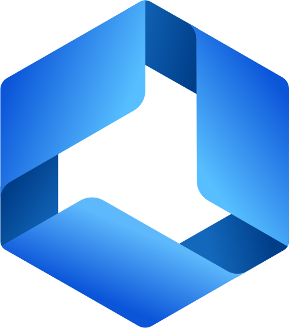

<h1 align="center"><b>Welcome to the Nexar Developer GitHub</b></h1>

The Nexar API is a GraphQL based API that brings together many elements of the electronics industry. This includes:

- Comprehensive supply data from Octopart
- Design information from Altium 365
- Manufacturing information via Altimade
- Intelligent and actionable insights for design, supply and manufacturing via Spectra

If you haven't already, you can sign up for a Nexar account on [our website](https://nexar.com/). If you aren't familiar with GraphQL, you may find it useful and interesting to go through [GraphQL's tutorial](https://graphql.org/learn/). If you are stuck and need some help, you can browse [our documentation or reach out to support](https://support.nexar.com/support/home).

    <picture>
        <source media="(prefers-color-scheme: dark)" srcset="https://github.com/NexarDeveloper/.github-private/blob/main/profile/static/Nexar-Logo-Lockup-Horizontal-4C-DkBG.svg">
        <source media="(prefers-color-scheme: light)" srcset="https://github.com/NexarDeveloper/.github-private/blob/main/profile/static/Nexar-Logo-Lockup-Horizontal-4C-LtBg.svg">
        
    </picture>
    <picture>
        
    </picture>
    <picture>
        <source media="(prefers-color-scheme: dark)" srcset="https://github.com/NexarDeveloper/.github-private/blob/main/profile/static/A20-Altium-Logo_A365-Horiz-Lt.svg">
        <source media="(prefers-color-scheme: light)" srcset="https://github.com/NexarDeveloper/.github-private/blob/main/profile/static/A20-Altium-Logo_A365-Horiz-Dk.svg">
        
    </picture>

## Where to start, if you are interested in...

_Note: To use any of these examples yourself you will need to have a Nexar account. [Sign up here](https://portal.nexar.com/sign-up). Once you have an account, your first application will be setup for you and you can take the authorization credentials from there and use them in any of our applications. Please see our support articles on [applications](https://support.nexar.com/support/solutions/articles/101000436377-what-are-nexar-applications-) and [authorization](https://support.nexar.com/support/solutions/articles/101000471994-authorization) for more information._

<h3>
    
    Component Supply Data from Octopart
</h3>

We recommend that you start with the [nexar-first-supply-query](https://github.com/NexarDeveloper/nexar-first-supply-query) which shows you how to query the supply side of the API in a simple console app. There are scripts in Python, Javascript and C#.

If you want to see a larger application using the supply API, please see our [supply web demo](https://web-supply-demo.nexar.com/), and it's [code on GitHub](https://github.com/NexarDeveloper/web-supply-demo-blazor).

<h3>
    
    Your Altium 365 Design Information
</h3>

We recommend that you start with the [nexar-first-design-query](https://github.com/NexarDeveloper/nexar-first-design-query) which shows you how to query the design side of the API in a simple console app. This example has scripts in Python and Javascript.

If you want to see a larger application using the design API, please see our [design web demo](https://web-design-demo.nexar.com/), and it's [code on GitHub](https://github.com/NexarDeveloper/web-design-demo-blazor).
